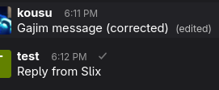

> [!WARNING]
> Moved to https://codeberg.org/kousu/slixclient


# slixclient

This is a small XMPP client for debugging XMPP.

```
$ uv run slixclient test@kousu.ca
Connecting to test@example.org.
Logged in as 'test@example.org'
> join testing@conference.example.org
[2026-03-24-9715db4bcbbee278] testing@conference.example.org/kousu: Gajim message
[2026-03-24-619a125547e29063] testing@conference.example.org/kousu: Gajim message (corrected)
> reply 2026-03-24-9715db4bcbbee278 Reply from Slix
[2026-03-24-8e5ee0a8369c08e8] testing@conference.example.org/test: [re: 2026-03-24-9715db4bcbbee278] Reply from Slix
```



## Installation

The fastest way to run this is to [get uv](https://docs.astral.sh/uv/getting-started/installation/#shell-autocompletion) and run

```
git clone git+https://github.com/kousu/slixclient
cd slixclient
uv run slixclient --help
```

But also

```
pipx install git+https://github.com/kousu/slixclient
slixclient --help
```

or

```
git clone git+https://github.com/kousu/slixclient
cd slixclient
python -m venv .venv
.venv/bin/python -m pip install -e .
.venv/bin/slixclient --help
```

## Usage

You'll need to give it an XMPP account, as explained in `--help`. You can either
run it interactively like

```
$ slixclient you@yourserver.com
Password:
```

or pass environment variables:
```
$ export XMPP_JID=you@yourserver.com
$ export XMPP_PASSWORD=$(your-password-manager you@yourserver.com)
$ slixclient you@yourserver.com
```

Once you're in the menu has:

- msg target@server.com body: send a message; works for both groupchats and DMs
- join room@server.com: join the given groupchat
- reply msgid body: send a reply to the given msgid; the original needs to be known to this client (i.e. you can't reply to anything sent before you connected, there's no history support)
- break: drop into Pdb; `xmpp` is the active client object.
- exit or quit or Ctrl-D: disconnect
- log on: enable debug logging (namely: YOU CAN SEE THE STANZAS)
- log off: disable debug logging

## Scripting

Since this is for debugging you SHOULD script complex interactions by **editing the code**. Edit `src/kousu/slixclient/slixclient.py`.
[slixmpp](https://slixmpp.readthedocs.io/en/latest/) is pretty friendly; and for when it's too confusing, this code is all async
so it's safe to pepper your code with `breakpoint()` and inspect the data structures.

Add new entries to the menu. Add new data structures as needed. Don't be shy. Save your versions and share them.
